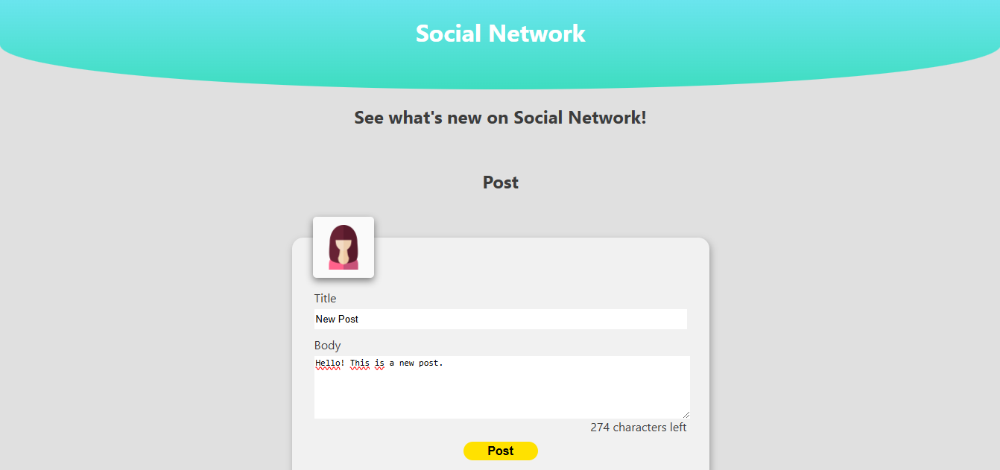
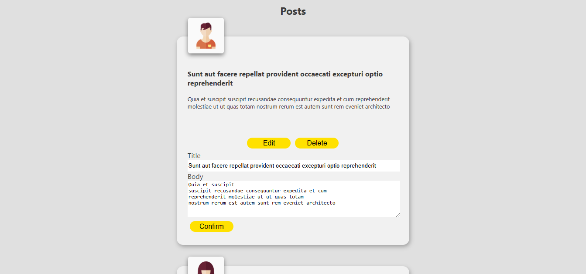

# Red Social
## Habilidades Practicadas
- Métodos GET, POST y DELETE en APIs
- Programación imperativa en Javascript
- DOM
- HTML y CSS

## Imagen
¡Haga click en la imagen para interactuar con la página!

  
  

